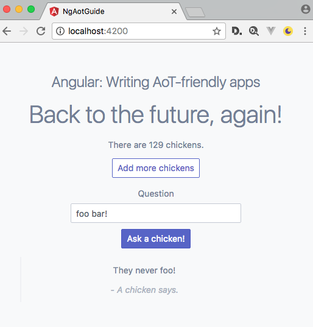
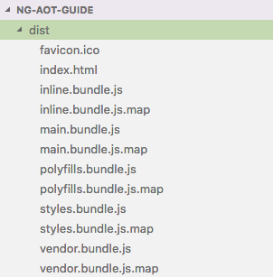
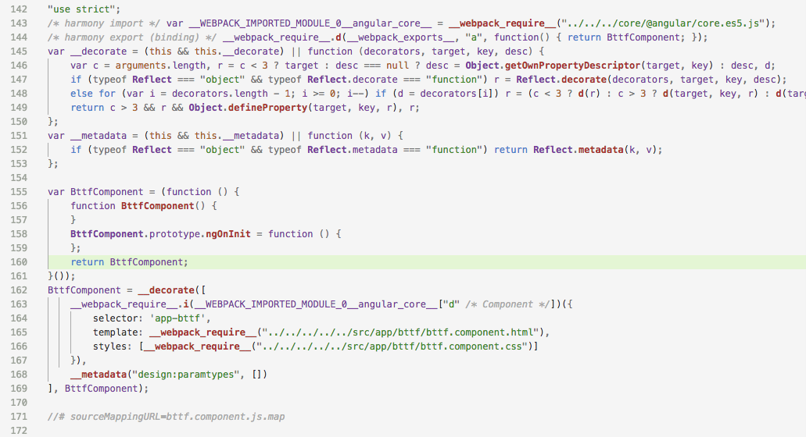

Angular: writing AoT-friendly apps
==================================

> [Read the full story on medium.com](https://medium.com/spektrakel-blog/angular-writing-aot-friendly-applications-7b64c8afbe3f)

This article is published under my [Spektrakel Blog on Medium.com](https://medium.com/spektrakel-blog/angular-writing-aot-friendly-applications-7b64c8afbe3f).
It describes development guidelines and instructions how to write AoT-compatible apps with the Angular CLI and talks through this topic by an example app.
You find the code for the example app in this repository.

[](https://medium.com/spektrakel-blog/angular-writing-aot-friendly-applications-7b64c8afbe3f)

Here is a short walk-through for the example:

## Kick-start a project

First, install the Angular CLI and bootstrap a new project:

```bash
$ npm install -g @angular/cli
$ ng set --global packageManager yarn
$ ng new ng-aot-guide
$ cd ng-aot-guide
$ yarn add spectre.css
```

Generate some code for the demo application, an `NgModule`, a `Component`, and a `Service`.

```bash
$ ng generate module bttf
$ ng generate component bttf
$ ng generate service bttf/bttf
```

A first glance at the app:

```bash
$ ng serve
```

Then open [http://localhost:4200](http://localhost:4200) and you see a screen yelling "_bttf works!_"


**NOTE**: _bttf_ is an abbreviation for _back to the future_.
Yes, it's some play of words... _ahead of time_, _back to the future_, well, err...


#### Serving and Building – w/ AoT – w/o AoT

Build the application (by default w/o AoT):

```bash
$ ng build
```


The Angular CLI outputs the build artefacts in the `dist` folder which now looks like this:



Build for production w/ AoT:

```bash
$ ng build --prod
```


## A chicken application

Checkout the Git tag `baseline` or [take a look at that commit](./releases/tag/baseline).

In JiT compilation (`ng build --dev`), the application works fine.
However, with AoT compilation (`ng build --prod`), we encounter several errors.
We will talk through this errors and look how to fix and void them.


#### Common Mis-Take #1: Factory functions must be exported, named functions

The first error message is:

```
Error encountered resolving symbol values statically. Function calls are not supported.
Consider replacing the function or lambda with a reference to an exported function
```

It is caused in `bttf.module.ts` by the factory provider:

```ts
{
  provide: BttfService,
  useFactory: () => new BttfService()
}
```

With AoT compilation, lambda expressions (arrow functions in TypeScript jargon) are not supported for writing factories!
We have to replace the factory with a plain-old function:

```ts
export function myServiceFactory() {
  return new BttfService();
}

@NgModule({
  providers: [
    {
      provide: BttfService,
      useFactory: myServiceFactory
    }
  ]
})
export class BttfModule {}
```

You can see the solution in the Git tag `fix-1`.
[Take a look at it](releases/tag/fix-1)!

***WARNING***: the Tour-of-Heroes on [angular.io](https://angular.io/) gives a non-working example for factory providers.
The document is [outdated](https://github.com/angular/angular/issues/17042) and [needs to be updated](https://github.com/angular/angular/pull/17081)!


#### Common Mis-Take #2: bound properties must be public

Now, when running `ng build --prod` again, another error shows up:

```
Property '{xyz}' is private and only accessible within class '{component}'
```

The error is caused by two places in `bttf.component.ts` and `bttf.component.html`.
In the HTML template, we have a text interpolation binding for the headline and an event binding for the form:

```html
<h2>{{ message }}</h2>

<form #f="ngForm" (ngSubmit)="onSubmit(f.controls.question.value)">
   ...
</form>
```

In the component class, the corresponding code snippet is:

```ts
@Component({ .. })
export class BttfComponent {
 
  private message: string = `Back to the future, again!`;

  private onSubmit(value: string) {
    /* .. */
  }
}
```

Both the property and the method need to be public members!
By simply removing the `private` keyword, both will be public by default.
So, the fix for this error is:

```ts
@Component({ .. })
export class BttfComponent {
 
  message: string = `Back to the future, again!`;

  onSubmit(value: string) {
    /* .. */
  }
}
```

If you like to be even more explicit, you can declare a `public message: string` as well as a `public onSubmit()` method.
The solution is shown in Git tag `fix-2` [whose commit you find here](releases/tag/fix-2)!


#### Common Mis-Take #3: call signatures for event bindings must match

There is one more issue with the application:

```
Supplied parameters do not match any signature of call target.
```

Again, this error is caused by `BttfComponent` and its template.
The code part in the template is:

```html
<button (click)="onAdd($event)">Add more {{ items }}</button>
```

And its counter-part in the component class:

```ts
@Component({ .. })
export class BttfComponent {

  onAdd() {
    this.count += 1;
  }

}
```

Notice that `onAdd()` does not declare a method parameter.
However, in the template, we try to pass the `$event` variable to the method.
This causes AoT compilation to fail and has two possible solutions.
First, change the method implementation in the class to accept a paramter or remove the paramter from the event binding in the template.
We choose to not pass `$event` to the method since it is not needed anyway.
The fixed template code is:

```html
<button (click)="onAdd()">Add more {{ items }}</button>
```

To see the solution in Git tag `fix-3` [you can view at this commit](releases/tag/fix-3)!


#### Building with AoT

Finally, compile the application for production with AoT enabled.

```bash
$ ng build --prod
```


There are noticable differences in the file sizes!
With the development build, `vendor.bundle.js` was 1.88MB in size and `main.bundle.js` was 7.51kB.
In the production build, `vendor.bundle.js` is **reduced to 1.07MB** and `main.bundle.js` has **grown to 23.6kB**.

This happens because of several effects:

 - First, in production build, the JavaScript files are minified.
 - Second, with AoT compilation, the [Angular compiler is no longer included in the vendor bundle](https://angular.io/guide/aot-compiler#inspect-the-bundle).
The package `@angular/compiler` accounts for roughly 999kB in unmified, plain ES5 code!
   - As [Minko Gechev points out](http://blog.mgechev.com/2016/08/14/ahead-of-time-compilation-angular-offline-precompilation/#what-we-get-from-aot), ommitting the compiler from the vendor bundle saves us quite a few KWh of energy on the planet!
   - On top, [AoT applications will run much faster](https://blog.nrwl.io/angular-is-aot-worth-it-8fa02eaf64d4) in the web browser!

These performance improvements are achieved by a trade-off.
With AoT compilation, so-called **factory code for components is generated**.
The generated code lives in intermediate `*.ngfactory.ts` files.
The Angular CLI generates these files under the hood and does not make them visible to the user.
Since that code needs to be included in the application, the `main.bundle.js` **is increased in file size** (from 7.51kB to 23.6kB, ~3 times even though minificaiton is applied) and the build **takes longer to execute** (from ~26sec to ~34 sec) in the above example.


## A look inside the generated factory code

The compiled version of `BttfComponent`:



The generated factory code for the component reflects view definitions:


Notice some well-known code patterns from the past:
the call to `co.onAdd()` is invoked for the event binding.
It checks for `if(('click' == en))`, then checks the return value `_co.onAdd() !== false`, stores it in a local `pd_0` variable, and returns a boolean from evaluating `(pd_0 && ad)`.

In the past, prior to Angular and data binding frameworks, plain-old DOM manipulating JavaScript code looked like:

```js
elem.addEventListener(function (evt) {
  if (evt.type === 'click') {
    /* do things... */
    return true; // cancel the event
  }
});
```

With Angular's data binding, this code is written in the template with the following expression:

```html
<button (click)="onAdd($event)">Add more chicken</button>
```

**Notice**:
the auto-generated **factory code reflect the component's template**, albei in a slightly different way.
The transformation from HTML markup to JavaScript instructions is performed by Angular AoT compiler.

It also means that the compiler performs type checking from code expressions in a component's HTML template.
The template is transformed into TypeScript factory code.
The factory code is compiled and depends on the component class.
Now it becomes clear why certain errors occured:
how could a factory invoke the `private onAdd()` method with the parameter `$event`?
It simply cannot and throws a type error.
These are exactly the kind of errors we have to fix to make AoT work!

